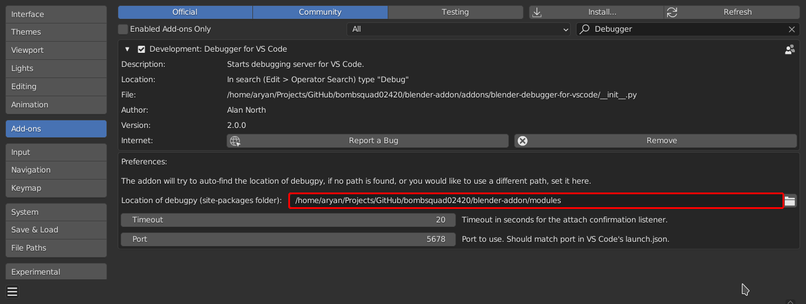
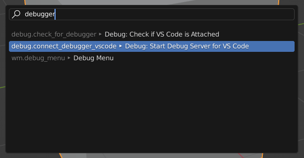
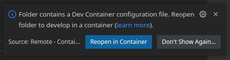
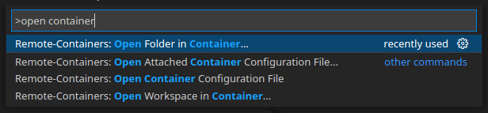
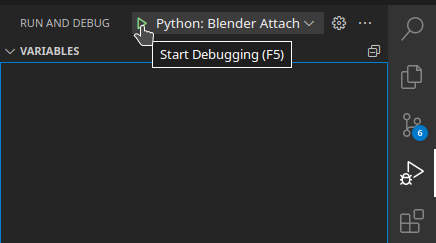
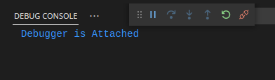
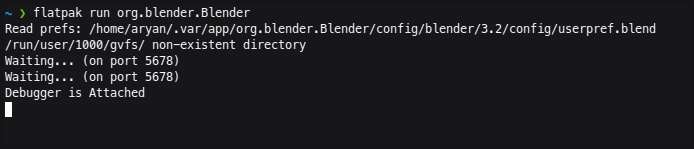

# Setup

Instructions for setting up the dev environment

[Read Original](https://github.com/bombsquad02420/blender-debugger-for-vscode)

## Pre-reqs:

- VS Code
- Blender

If you are not using Docker
- Python 3.10[^1]
- Python extension for VS Code (`ms-python.python`)[^1]
- Pylance extension for VS Code (`ms-python.vscode-pylance`)[^1]

If you are using docker
- Docker[^2]
- Remote Containers extension for VS Code (`ms-vscode-remote.vscode-remote-extensionpack`)[^2]

[^1]:
    Only if not using Docker
[^2]:
    Only if uusing Docker


## Steps

1. Clone the repo

    ```bash
    git clone --recursive https://github.com/bombsquad02420/blender-addon.git

    cd blender-addon
    ```

1. Install modules for development[^1]

    ```bash
    pip install -r requirements.txt
    ```

1. Install additional modules (for Blender to use)[^1]

    ```bash
    pip install --target=modules -r requirements.blender.txt
    ```

1. Add the repo's root folder (from STEP 1) to Blender's `script` data path. `Edit` > `Preferences` > `File Path`

    

1. Search for `debugger` in `Add-ons` panel and enable the `Debugger for VS Code` extension. Under the extension's preferences the path (from STEP 3) to `debugpy` should be auto-detected.

    

1. Make sure the port is `5678` and timeout is set to a large enough value.

1. Search for debugger and start the debugger

    

1. Open repo in VS Code

1. Open in Container[^2]

    Make sure the docker daemon is running and has proper priviledges (user must be added to the docker group. sudo must not be used)

    Click `Open in Container` in notification prompt

    

    Or use the Command Palette

    


1. In VSCode's Debug Panel (`Ctrl + Shift + D`), start the debugger (`F5`) with `Python: Blender Attach` configuration (or `Docker: Blender Attach`).

    

1. VSCode's Debug Console and Blender Console should show attached message

    

    

# Other Stuff

1. Update submodules[^1]

    ```bash
    git submodule update --remote --merge
    ```

1. Auto-reload Blender scripts 

    *TODO*

    ```json
    // .vscode/tasks.json
    {
        "version": "2.0.0",
        "tasks": [
            {
                "label": "Blender: Reload Scripts",
                "command": "${input:blender.reloadScripts}",
                "problemMatcher": [],
            },
        ],
        "inputs": [
            {
                "id": "blender.reloadScripts",
                "type": "command",
                "command": "debugadapter-evaluate.evaluate",
                "args": "import bpy; bpy.ops.script.reload()",
            },
        ],
    }
    ```

    Preferences: Open Keyboard Shortcuts (JSON)

    ```json
    // /home/aryan/.config/Code/User/keybindings.json
    [
        {
            "key": "ctrl+k t",
            "command": "debugadapter-evaluate.evaluate",
            "args": "import bpy; bpy.ops.script.reload()",
        }
    ]
    ```

    Autoatically on save (figure out how to run task (reload scripts in blender) on save)
    
    ```json
    // .vscode/settings.json
    {
        "editor.codeActionsOnSave": {},
    }
    ```
